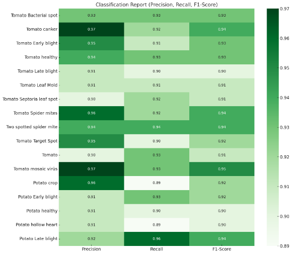

PLANT DISEASES CLASSIFICATION REPORT

Early diagnosis of plant diseases is of great importance to increase productivity and product quality in agriculture. In this study, a deep learning model based on EfficientNet was used to detect various diseases seen in tomato and potato plants. A dataset containing approximately 40,000 images was utilized, and the model's accuracy reached levels of 94%.
Dataset Used The dataset consists of a total of 15 classes:

•	Tomato Classes (10 units): Tomato Bacterial spot, Tomato canker, Tomato Early blight, Tomato healthy, Tomato Late blight, Tomato Leaf Mold, Tomato Septoria leaf spot, Tomato Spider mites Two spotted spider mite, Tomato Target Spot, Tomato mosaic virus.

•	Potato Classes (5 units): Potato crop, Potato Early blight, Potato healthy, Potato hollow heart, Potato Late blight. Each class contains approximately 2500 images to ensure balance.

Model Architecture The model used in this project is built on the EfficientNet-B0 architecture. EfficientNet is a parametrically optimized convolutional neural network that can offer high performance even on mobile devices.

Technical Details:

•	Model Base: EfficientNet-B0 
•	Input Size: 224 x 224 x 3 
•	Number of Layers: 237 
•	Number of Parameters: ≈ 5.3 million 
•	Activation Function: Swish 
•	Optimization: Adam 
•	Loss Function: Categorical Crossentropy 
•	Number of Epochs: 25 
•	Learning Rate: 0.0003 
•	Batch Size: 32 

Training Results

•	The overall accuracy rate of the model on the test set was measured as 94%.
•	Training was limited to 25 epochs and lasted approximately 8-9 hours.
•	No overfitting was observed during training.

Table 1: Classification Report (Precision, Recall, F1-Score) 

  

Confusion Matrix A confusion matrix was created to understand how the model experiences confusion between classes.

•	Most confused classes: 

o	Tomato Early blight ↔ Tomato Late blight 
o	Tomato Leaf Mold ↔ Tomato Septoria leaf spot 
o	Potato Late blight ↔ Potato Early blight 

Figure 1: Confusion Matrix 

